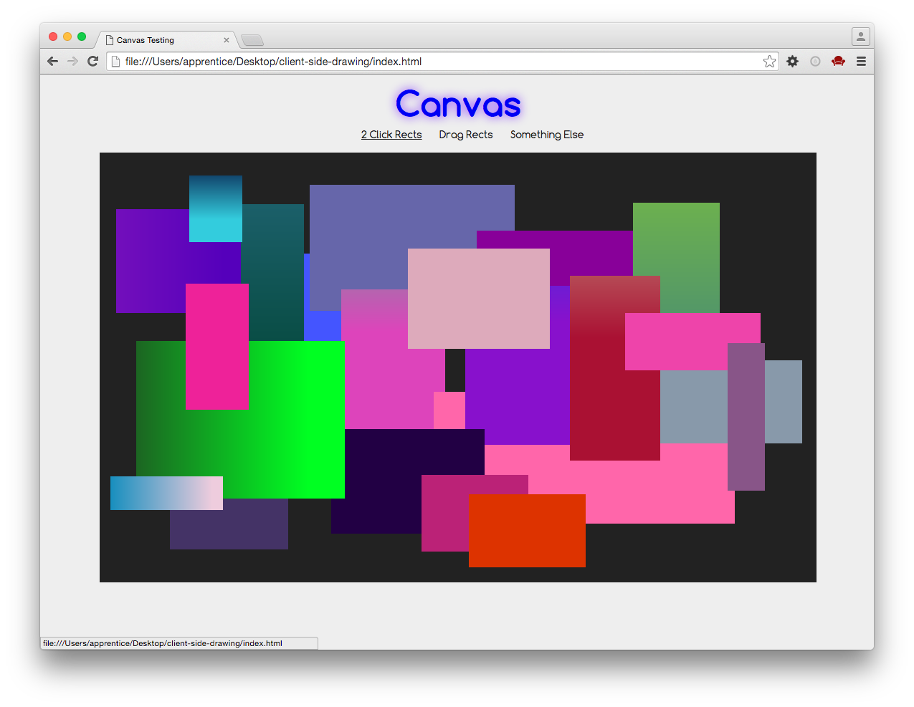

# DBC Thundertalk: Client-Side Drawing

## 2 Click Rects

This is an example of drawing rectangles with random color gradients, produced when you click the canvas twice. On the second click, a rectangle will be drawn in the space between your two clicks:

