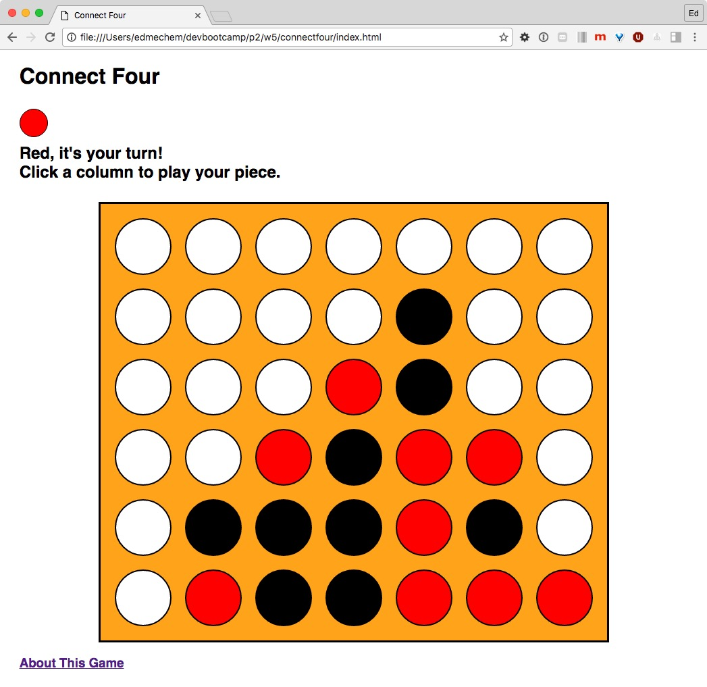

# Connect Four

Implementation of [Connect Four](https://en.wikipedia.org/wiki/Connect_Four) using JavaScript, CSS & HTML.  

[Playable game](https://edmechem.github.io/connectfour/index.html) on GitHub.

## Minimum Viable Product

* A user can see a board
* A user can see a styled board
* A user can place a piece into a column
* Users place alternating black and red pieces on the board
* Users can't place a piece in a filled column
* Users are notified when they win the game (vertical, horizontal and diagonal win cases)
* Users are notified when there is no possible way for either player to win a game
* Users can play against each other in the same browser

## Stretch Goals

* CSS is responsive; game can easily be played on mobile
* A user can see an animation when they place a piece

Completed as a solo project by myself, [Ed Mechem](https://github.com/edmechem); initially begun as a [Dev Bootcamp](https://github.com/sf-pocket-gophers-2016/phase-2-guide/blob/sf/resources/connect_four.md) Phase 2 group project along with [Hank Chen](https://github.com/Hank860502), [Robin Soubry](https://github.com/RobinSoubry), [Sneha Narasimhan](https://github.com/snehabn) & [Umar Bajwa](https://github.com/UmarFBajwa).

MVP has been reached, the project is done for now; possible future work to meet stretch goals.
